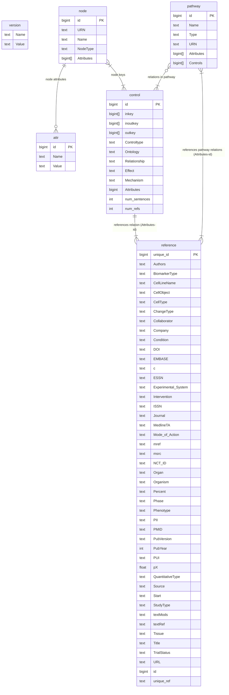

# EmBiology PostgreSQL Loader
Python scripts to load the EmBiology rnef data dump into a PostgreSQL database.

## Prerequisites
1. Create a PostgreSQL database if it does not exist yet
2. Update database credentials in [src/credentials.py](src/credentials.py)

## Python Dependencies
- psycopg2

## How to Use
Scripts are designed to run from the data directory where the EmBiology rnef dump has been downloaded. The script [readresnet.py](readresnet.py) reads the rnef file and creates temporary data tables. [create_tables.py](create_tables.py) will deduplicate the data and load them into PostgreSQL. A schema name has to be provided to [create_tables.py](create_tables.py) as a command line argument. If the requested schema name ends on '_temp', the script assumes that an existing schema without the '_temp' suffix should be updated with new data. Currently, a full data load (schema without the '_temp' suffix) is the recommended way to load and update EmBiology data. Both scripts were tested and run on a Linux environment. Processing the data on a Windows machine might introduce carriage returns that would have to be removed before data loading into PostgreSQL.

### Example
Read rnef file and create temporary data tables locally: <br>
```sh
python readresnet.py resnet18_dump_09152024.rnef
```

Data deduplication and loading into PostgreSQL schema 'resnet': <br>
```sh
python create_tables.py resnet
```

### Create CSV File Data Tables (Optional)
If needed, CSV files can be generated from the temporary data tables. After deduplication, each table will be written out as a compressed CSV file. Please note that the uncompressed reference table is approximately 54GB in size. Due to its size, the reference table is not deduplicated on disk; this step is typically performed directly within PostgreSQL. We usually do not observe duplicates in this table. Additionally, the relationship (control) CSV file will not include sentence and reference counts, as these are calculated during the data loading process into PostgreSQL.

To generate the CSV files, first run the [readresnet.py](readresnet.py) script as described above, followed by:<br>
```sh
python create_csv.py
```

Column names and data types of each CSV file are written to the log file for reference. Similar to the PostgreSQL version, the data in CSV format can be joined as follows:
- Node attributes: Join `node.attributes` with `attr.id`
- Nodes and relationships: Join `node.id` with `control.inkey`, `control.inoutkey`, or `control.outkey`
- Relationships and references: Join `control.attributes` with `reference.id`

## Notes
Considerable disk space is required for loading the EmBiology rnef data dump into PostgreSQL. The uncompressed rnef file has a size of ~108GB. Temporary data tables written to disk require another ~60GB. Once all data is loaded into PostgreSQL, indexing will be applied to facilitate downstream usage of the data (see [sql/resnet.sql](sql/resnet.sql) for details). Unique sentences and citations for each relationship will be counted and added to the tables at this stage.

### Current Database Counts (Mar 2025)
- Attributes: 9285718
- Nodes: 1517398
- Relations: 18140698
- References: 81271041
- Pathways: 0

## Database Schema

